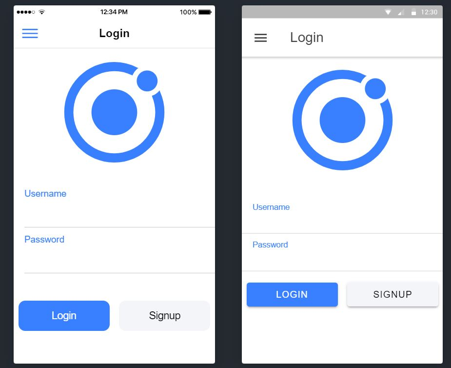
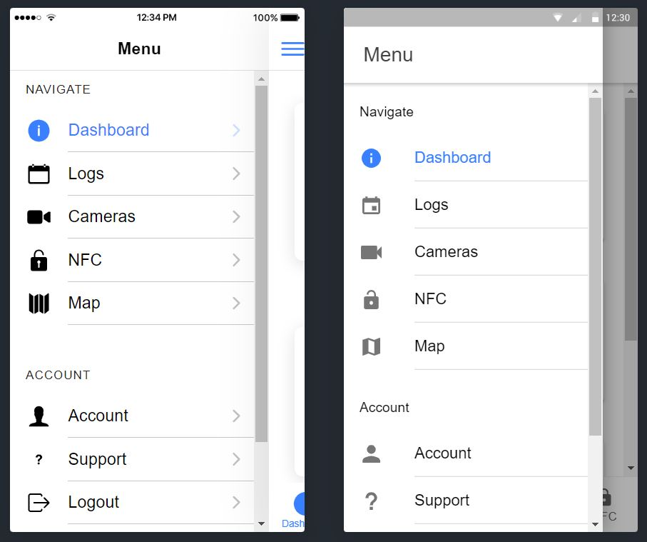
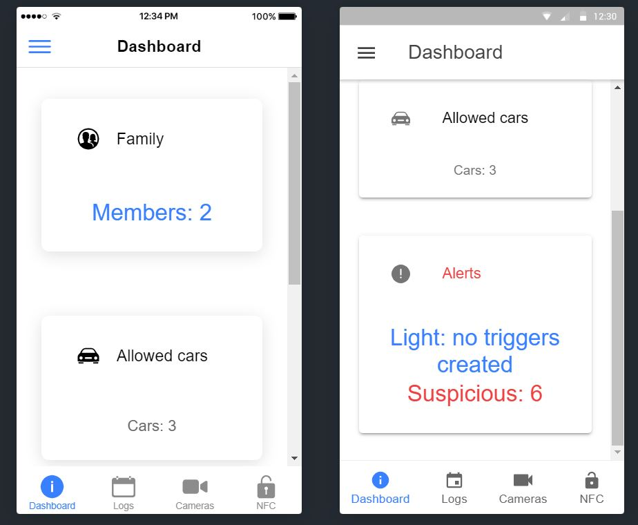
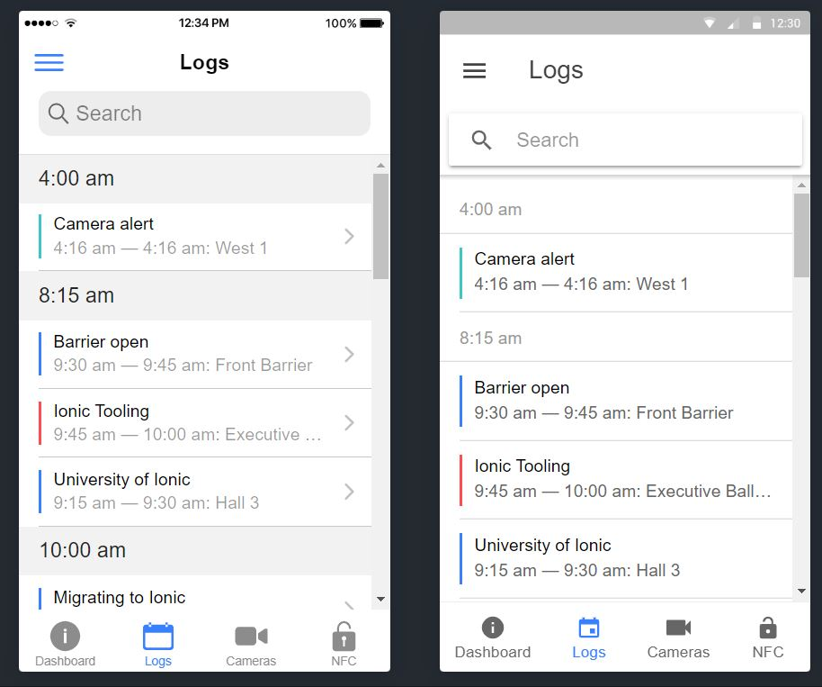
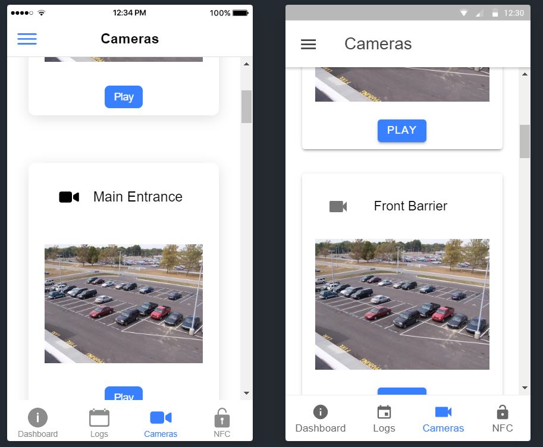
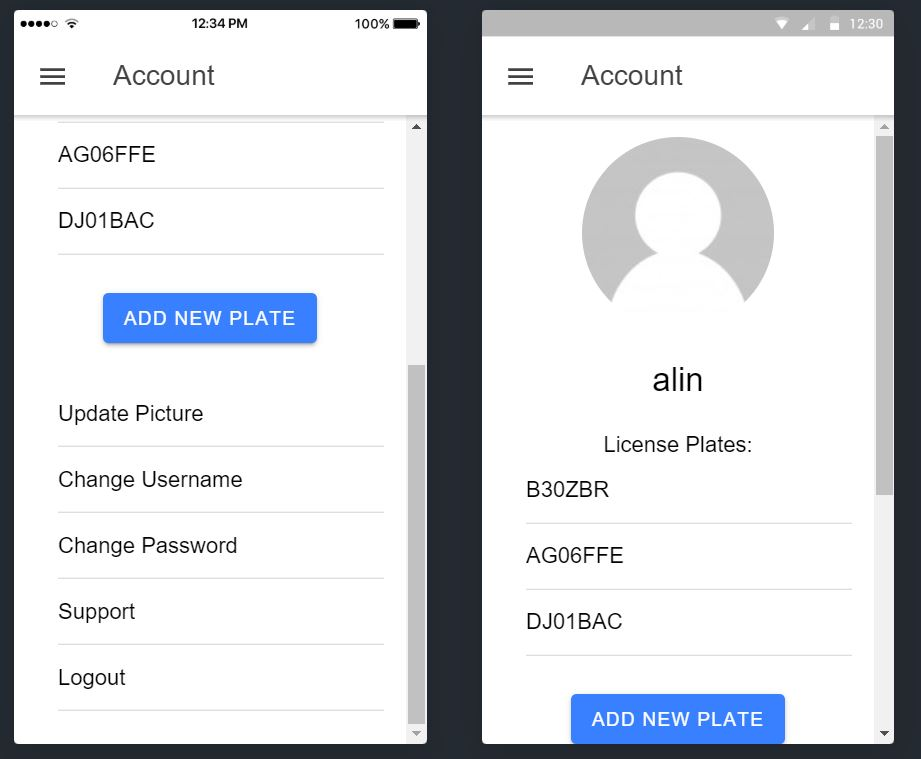
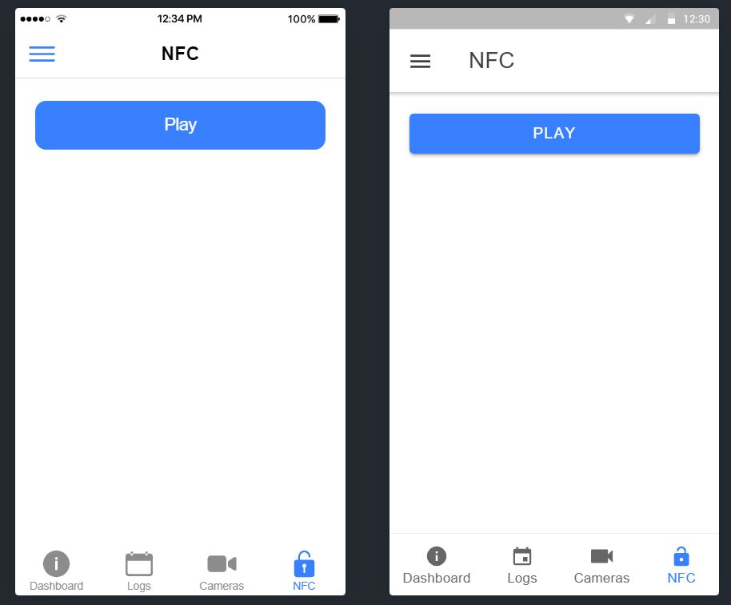

# Ionic Connected Neighbourhood Application

This application is developed by Ansamblul Computational Vatra Luminoasa.
It's currently under development, and it calls localhost endpoints. 
It might not work untill we will have the backend deployed.
In the resources folder we have attached screenshots.

**Please refer to us if you want all the endpoints mocked**

## Table of Contents
- [Getting Started](#getting-started)
- [Contributing](#contributing)
- [App Preview](#app-preview)
- [Running](#Running)
  - [Web Browser](#Web-browser)
  - [Android](#android)
  - [iOS](#ios)

## Getting Started

* [Download the installer](https://nodejs.org/) for Node.js 6 or greater.
* Install the ionic CLI globally: `npm install -g ionic`
* Clone this repository: `git clone https://github.com/ionic-team/ionic-conference-app.git`.
* Run `npm install` from the project root.
* Run `ionic serve` in a terminal from the project root.
* Profit. :tada:

_Note: See [How to Prevent Permissions Errors](https://docs.npmjs.com/getting-started/fixing-npm-permissions) if you are running into issues when trying to install packages globally._

## App Preview

All app preview screenshots were taken by running `ionic serve --lab` on a retina display.

- [Login Page](https://github.com/argesis13/smart-neighbourhood/blob/develop/src/app/pages/login/login.html)
  
  
- [Menu Page](https://github.com/argesis13/smart-neighbourhood/blob/develop/src/app/pages/dashboard/dashboard.page.html)

  
  
- [Dashboard Page](https://github.com/argesis13/smart-neighbourhood/blob/develop/src/app/pages/dashboard/dashboard.page.html)

  

- [Logs Page](https://github.com/argesis13/smart-neighbourhood/blob/develop/src/app/pages/logs/logs.html)

  

- [Cameras Page](https://github.com/argesis13/smart-neighbourhood/blob/develop/src/app/pages/video-player/video-player.page.html)

  
  
- [Account Page](https://github.com/argesis13/smart-neighbourhood/blob/develop/src/app/pages/account/account.html)

  

- [NFC Page](https://github.com/argesis13/smart-neighbourhood/blob/develop/src/app/pages/nfc/nfc.page.html)

  

## Running

### Android & IOS

1. Run `ionic integrations enable capacitor`
2. Run `ionic build`
3. Run `npx cap add ios`
4. Run `npx cap add android`
5. Run `npx cap sync`
6. Run `npx cap copy`
7. Run `npx cap open ios`

